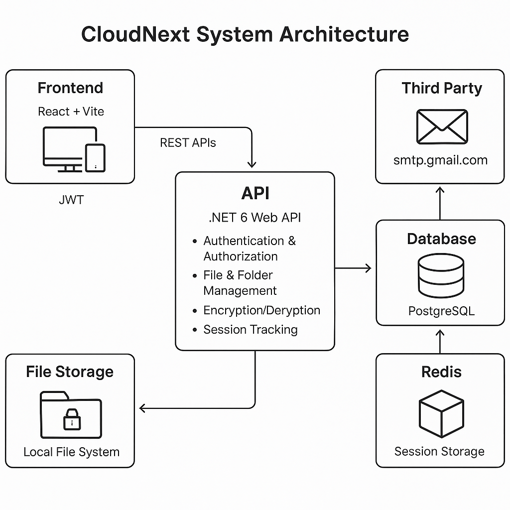
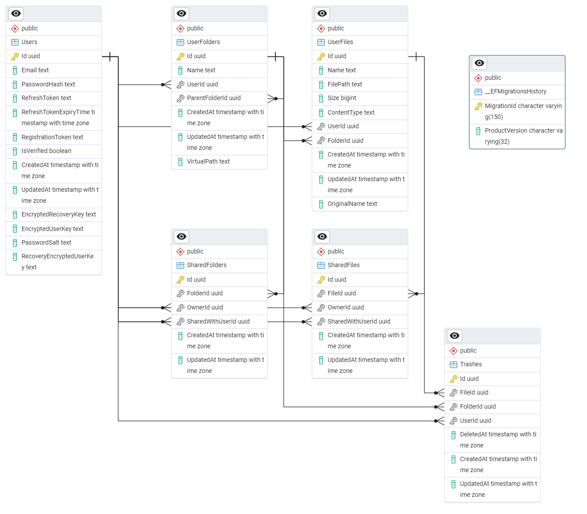

## Related Repository

Frontend Web Application:
https://github.com/DaniJani2025/CloudNext.Frontend

---

# CloudNext Backend

CloudNext is a security-first file and folder management platform inspired by services like Google Drive.

This repository contains the **.NET 8 Web API backend** for CloudNext.  
The frontend web application is maintained separately in the `CloudNext.Frontend` repository.

---

## Overview

CloudNext enables users to securely store, organize, and manage files and folders.

At account creation, a unique cryptographic key is generated for the user.  
If this key is lost, stored data becomes non-recoverable by design.

The system follows a strict zero-recovery security principle — the platform does not retain the ability to decrypt user data without the user’s key.

The backend is responsible for:

- Authentication and authorization
- JWT token generation and validation
- File and folder management logic
- Secure key handling
- Database persistence
- Enforcement of security constraints

---

## Core Features

- Secure JWT-based authentication
- User account management
- Key generation at account creation
- File and folder CRUD operations
- Structured deletion logic
- Encrypted storage workflow
- Strict key-dependent data access

---

## Tech Stack

- .NET 8
- ASP.NET Core Web API
- Entity Framework Core (if applicable)
- SQL Database (specify type if desired)
- JWT Authentication
- SMTP integration (if used)

---

## Architecture

The backend follows a layered architecture:

- **Controllers** – API endpoints
- **Services** – Business logic layer
- **Data Access Layer** – Database interaction
- **Infrastructure Layer** – File system operations and external services

Security-sensitive operations are isolated within the service layer to maintain clear separation of concerns.

### System Architecture Diagram



---

## Database Schema



The database maintains structured relationships between users, files, and folders to support hierarchical storage and secure ownership mapping.

---

## Security Model

CloudNext enforces a strict key-based security model:

- User encryption keys are generated at account creation.
- Keys are not stored in recoverable form.
- If a user loses their key, data cannot be restored.
- JWT signing keys are stored securely via environment variables.
- Sensitive values are never committed to source control.

The backend does not provide recovery mechanisms for lost encryption keys.

---

## Running the App

1. Restore dependencies:

```bash
dotnet restore
```

2. Run the App:

```bash
dotnet run
```
